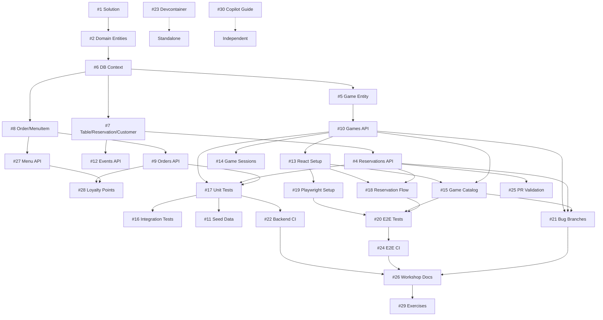

# Board Game Café Management System

> Demo environment for Testing Automation engineers showcasing GitHub Copilot's testing capabilities

[](https://dotnet.microsoft.com/)
[](https://reactjs.org/)
[](https://www.typescriptlang.org/)
[](https://opensource.org/licenses/MIT)

## 🎯 Purpose

This repository provides a **fork-friendly demo environment** for Test Engineers to explore GitHub Copilot's capabilities across:

- ✅ **Unit Test Generation** - C# backend business logic testing
- 🌐 **Web API Testing** - REST endpoint contract testing with Swagger/OpenAPI
- 🎭 **Visual/UI Testing** - Playwright cross-browser automation (Chrome, Safari, Firefox)
- 🐛 **Bug Hunting & Regression Tests** - Intentional bugs to find and fix
- 🎲 **Test Data Generation** - Realistic mocks and seed data
- 🚀 **CI/CD Integration** - GitHub Actions automation

## 🎮 What You'll Build

A **Board Game Café Management System** featuring:

### Customer Features
- 🎲 Browse game catalog with filters (player count, complexity, category)
- 📅 Reserve tables with visual availability calendar
- 🍕 Order food & beverages from themed menu
- 🎟️ Register for events (tournaments, game nights)
- ⭐ Loyalty points & membership tiers (Bronze/Silver/Gold)

### Staff Features
- ✅ Check-in reservations
- 📦 Game inventory checkout/return tracking
- 🍔 Order fulfillment queue
- 🎉 Event management

### Admin Features
- 📚 Game catalog management
- 🍽️ Menu item configuration
- 📊 Analytics & reporting

## 🏗️ Architecture

### Backend
- **.NET 9.0** Minimal APIs (Vertical Slice Architecture)
- **Entity Framework Core** with SQLite (default) / PostgreSQL (optional)
- **Swashbuckle** for auto-generated OpenAPI/Swagger documentation
- **FluentValidation** for request validation
- **xUnit** + **FluentAssertions** for testing

### Frontend
- **React 18+** with TypeScript
- **Vite** for blazing-fast development
- **TanStack Query** for server state management
- **Playwright** for E2E testing

### DevOps
- **VS Code DevContainer** (zero-config setup)
- **GitHub Actions** CI/CD workflows
- **Docker Compose** for optional PostgreSQL

## 🚀 Quick Start

### Option 1: GitHub Codespaces (Recommended)

1. Click **Code** → **Create codespace on main**
2. Wait for automatic setup (dependencies, migrations, seed data)
3. Open Swagger UI: `https://localhost:5001/swagger`
4. Start frontend: Terminal → Run Task → `watch:client`

### Option 2: Local Development

**Prerequisites:**
- [.NET 9 SDK](https://dotnet.microsoft.com/download)
- [Node.js 20+ LTS](https://nodejs.org/)
- [VS Code](https://code.visualstudio.com/)

```bash
# Clone repository
git clone https://github.com/equalizer999/board-game-jam-plan.git
cd board-game-jam-plan

# Restore backend
cd src/BoardGameCafe.Api
dotnet restore
dotnet ef database update
dotnet run

# In new terminal: Start frontend
cd client
npm install
npm run dev
```

**Access:**
- Frontend: http://localhost:5173
- API: https://localhost:5001
- Swagger: https://localhost:5001/swagger

## 📚 Workshop Structure

This demo maps to a **60-minute workshop agenda**:

| Time | Topic | Demo Focus |
|------|-------|------------|
| 0-15min | Welcome & Context | Copilot capabilities overview |
| 15-25min | Unit Test Generation | `OrderCalculationService`, `ReservationValidator` |
| 25-33min | Web API Testing | REST endpoints, Swagger contract testing |
| 33-40min | UI Testing (Playwright) | Cross-browser reservation workflow |
| 40-50min | Bug Hunting & Regression | Intentional bugs in separate branches |
| 50-55min | CI/CD Integration | GitHub Actions test automation |
| 55-60min | Q&A | Live test generation |

### 📖 Reference Materials

- **[Copilot Prompts Guide](docs/copilot-prompts-guide.md)** - Effective prompts for test generation
- **[Bug Hunting Guide](docs/bug-hunting-guide.md)** - Intentional bugs with hints
- **[API Testing Guide](docs/api-testing-guide.md)** - Using Swagger for exploration
- **[Implementation Roadmap](ROADMAP.md)** - Phased development plan

### 🎯 Exercise Folders

The `/exercises` folder contains workshop prompts with TODO markers for live demonstrations:

- `01-unit-testing.md` - Service layer testing exercises
- `02-api-testing.md` - Integration test scenarios
- `03-ui-testing.md` - Playwright workflow examples
- `04-bug-hunting.md` - Regression test challenges

## 🐛 Intentional Bugs

Separate branches contain curated bugs for regression testing practice:

- `bug/midnight-reservation` - Timezone conversion issue
- `bug/double-discount` - Negative totals from discount stacking
- `bug/vanishing-game` - Cache invalidation on checkout
- `bug/table-time-traveler` - Past date validation bypass
- `bug/order-item-duplication` - Race condition on rapid clicks
- `bug/case-sensitive-email` - Duplicate accounts with email casing
- `bug/event-registration-race` - Concurrency on last event spot
- `bug/loyalty-points-reversal` - Cancelled orders don't deduct points

Each bug has a linked GitHub Issue with reproduction steps.

## 🧪 Testing

```bash
# Backend unit tests
dotnet test src/BoardGameCafe.Tests.Unit

# Backend integration tests
dotnet test src/BoardGameCafe.Tests.Integration

# Frontend unit tests
cd client && npm test

# E2E tests (Playwright)
cd client && npx playwright test

# E2E with UI
cd client && npx playwright test --ui

# Specific browser
cd client && npx playwright test --project=chromium
```

## 🏷️ Labels

Issues are tagged with:

- `backend` - .NET API work
- `frontend` - React UI work
- `testing` - Test infrastructure
- `devcontainer` - Development environment
- `bug-demo` - Intentional bugs for workshops
- `documentation` - Guides and READMEs
- `ci-cd` - GitHub Actions workflows
- `seed-data` - Database seeding
- `api` - REST endpoint development
- `swagger` - OpenAPI documentation
- `exercise` - Workshop exercises
- `performance` - Optimization tasks

## 🤖 Assigning to GitHub Copilot

This repository is designed for **GitHub Copilot Coding Agent** handoff:

```bash
# Example: Assign issue #5 to Copilot
# Navigate to issue → Comment:
@github-copilot implement this feature following the acceptance criteria
```

Or use the assignment button and select **Copilot** as the assignee.
## 🔗 Issue Dependencies & Assignment Order

To maximize GitHub Copilot effectiveness, follow this dependency-based assignment order:

### Quick Start Path

**Recommended first assignments to Copilot:**
1. Issue #1 → #2 → #6 → Then choose parallel tracks below

### Phase 1: Foundation (Sequential) 🏗️
```
#1 (Solution Structure)
  ↓
#2 (Domain Entities)
  ↓
#6 (Database Context)
  ↓
#5 #7 #8 (Can be assigned in parallel)
```

- **#1** - Initialize .NET 9 Solution Structure
  - No dependencies - START HERE
- **#2** - Add Remaining Domain Entities
  - Depends on: #1
- **#6** - Setup .NET 9 Solution Structure with Project References
  - Depends on: #1, #2
- **#5** - Create Game Domain Entity
  - Depends on: #6
- **#7** - Create Table, Reservation, Customer Entities
  - Depends on: #6
- **#8** - Implement Order and MenuItem Entities
  - Depends on: #6

### Phase 2: REST APIs (Can parallelize after Phase 1) 🚀
```
#10 (Games API) ← depends on #5
#4 (Reservations API) ← depends on #7
#9 (Orders API) ← depends on #8
#27 (Menu API) ← depends on #8
#12 (Events API) ← depends on #7
#14 (Game Sessions) ← depends on #10
#28 (Loyalty Points) ← depends on #9, #27
```

- **#10** - Build Games CRUD REST API
  - Depends on: #5
- **#3** - Build Games CRUD REST API Endpoints with Swagger
  - Depends on: #10 (duplicate of #10, use #10 instead)
- **#4** - Build Reservations REST API
  - Depends on: #7
- **#9** - Build Orders REST API
  - Depends on: #8
- **#27** - Build Menu REST API
  - Depends on: #8
- **#12** - Build Event Management System
  - Depends on: #7
- **#14** - Create Game Checkout/Return Workflow
  - Depends on: #10
- **#28** - Implement Loyalty Points System
  - Depends on: #9, #27

### Phase 3: Backend Testing (After Phase 2) 🧪
```
All Phase 2 APIs completed
  ↓
#17 (Unit Test Infrastructure)
#16 (Integration Tests)
#11 (Seed Data)
```

- **#17** - Setup Unit Testing Infrastructure
  - Depends on: Phase 2 complete (#10, #4, #9, #27, #12, #14, #28)
- **#16** - Create Integration Tests
  - Depends on: Phase 2 complete
- **#11** - Create Comprehensive Seed Data
  - Depends on: Phase 2 complete

### Phase 4: Frontend (Can start after #10, #4, #9) 🎨
```
#13 (React Setup)
  ↓
#15 (Game Catalog) ← needs #10
#18 (Reservation Flow) ← needs #4
```

- **#13** - Initialize React + TypeScript Frontend
  - Depends on: #10 (can start when at least one API exists)
- **#15** - Build Game Catalog UI
  - Depends on: #13, #10
- **#18** - Build Reservation Booking Flow
  - Depends on: #13, #4

### Phase 5: E2E Testing (After Phase 4) 🎭
```
#19 (Playwright Setup) ← needs #13
  ↓
#20 (E2E Tests) ← needs #15, #18
```

- **#19** - Setup Playwright E2E Infrastructure
  - Depends on: #13
- **#20** - Create Complete E2E Test Suite
  - Depends on: #19, #15, #18

### Phase 6: Bug Demonstrations (Manual - After Phase 2 & 4) 🐛
```
#21 - MANUAL TASK, do not assign to Copilot initially
```

- **#21** - Create Bug Demonstration Branches
  - Depends on: Phase 2 (#10, #4, #9), Phase 4 (#13, #15, #18)
  - ⚠️ **DO NOT assign to Copilot** - requires manual bug introduction

### Phase 7: CI/CD (Can parallelize) 🔄
```
#23 (Devcontainer) - no dependencies
#22 (Backend CI) ← needs Phase 3
#24 (E2E CI) ← needs #20
#25 (PR Validation) ← needs Phase 2
```

- **#23** - Configure VS Code Devcontainer
  - No dependencies (can start anytime)
- **#22** - Create GitHub Actions CI Workflow
  - Depends on: #17, #16 (backend tests)
- **#24** - Create E2E Workflow for Playwright
  - Depends on: #20
- **#25** - Create PR Validation Workflow
  - Depends on: Phase 2 complete

### Phase 8: Workshop Materials (Final phase) 📚
```
#26 (Workshop Docs) ← needs everything
#29 (Exercises) ← needs everything
#30 (Copilot Guide) - no code dependencies
```

- **#26** - Create Workshop Documentation
  - Depends on: All previous phases
- **#29** - Create Exercise Templates
  - Depends on: All previous phases
- **#30** - Document Copilot Agent Assignment
  - No code dependencies (documentation only)

### Optimal Assignment Strategy

#### For Maximum Parallelization:
1. **Week 1:** #1 → #2 → #6 → [#5, #7, #8 in parallel] → [#10, #4, #9, #27, #12 in parallel]
2. **Week 2:** #14 → #28 → [#17, #16, #11 in parallel] → #13 → [#15, #18 in parallel]
3. **Week 3:** #19 → #20 → #21 (manual) → [#22, #23, #24, #25 in parallel]
4. **Week 4:** [#26, #29, #30 in parallel]

#### For Linear/Learning Path:
Follow the phase order strictly: Phase 1 → Phase 2 → Phase 3 → Phase 4 → Phase 5 → Phase 6 → Phase 7 → Phase 8

### Visual Dependency Graph



### Issue Chaining with GitHub

When viewing any issue, check the "Depends on" and "Blocks" sections in the issue description (updated for all 30 issues) to see:
- **Depends on:** Issues that must be completed first
- **Blocks:** Issues that are waiting for this one to complete

This information helps you:
- Prioritize work correctly
- Avoid merge conflicts
- Understand the full context of each task
- See the bigger picture of how features connect

---


**See [ROADMAP.md](ROADMAP.md) for detailed issue assignment strategy.**

## 📈 Checkpoint Branches

Progressive implementation stages:

- `01-basic-crud` - Initial domain models + CRUD APIs
- `02-add-validation` - FluentValidation + error handling
- `03-business-logic` - Reservation conflicts, late fees, discounts
- `04-add-tests` - Full test coverage
- `05-complete` - Production-ready with CI/CD

## 🎨 Fun Elements

### Game-Themed Menu Items
- "Meeple Mocha" ☕
- "Catan Cappuccino" ☕
- "Ticket to Chai" 🍵
- "Pandemic Pizza" 🍕
- "Wingspan Wings" 🍗

### Loyalty Tiers
- 🥉 Bronze Explorer (0-499 points) - 5% discount
- 🥈 Silver Strategist (500-1999 points) - 10% discount + early event access
- 🥇 Gold Grandmaster (2000+ points) - 15% discount + free monthly rental

## 🤝 Contributing

This is a **demo repository** designed for workshops. For local customization:

1. Fork the repository
2. Create feature branch (`git checkout -b feature/your-idea`)
3. Run tests (`dotnet test && npm test`)
4. Commit with conventional commits
5. Open a Pull Request

## 📄 License

MIT License - see [LICENSE](LICENSE) file for details.

## 🙏 Acknowledgments

Built to showcase GitHub Copilot's testing capabilities for Test Automation engineers.

---

**Ready to explore?** Open the first issue and assign it to Copilot! 🚀