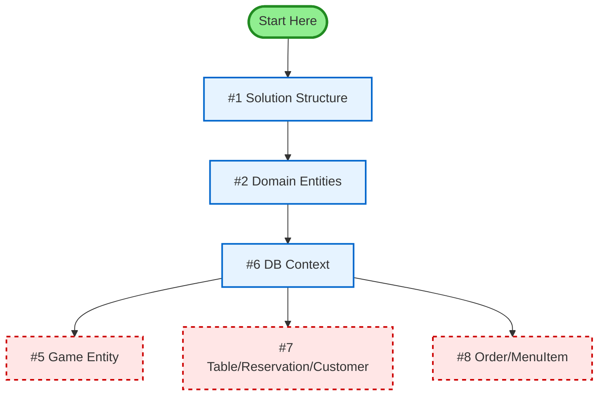
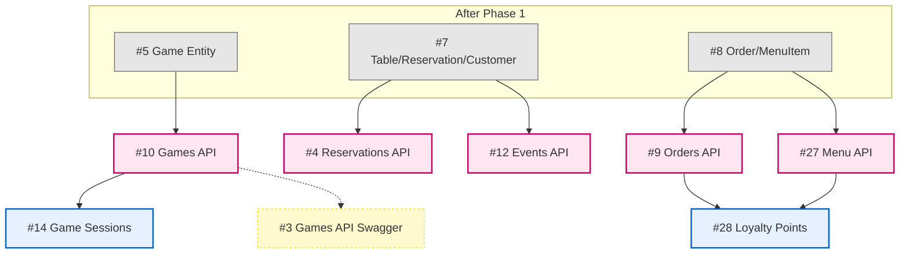
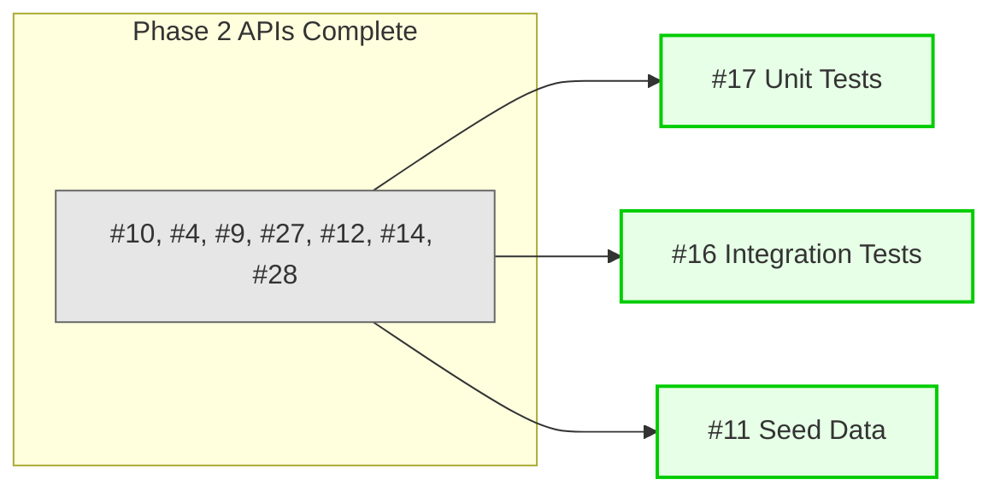
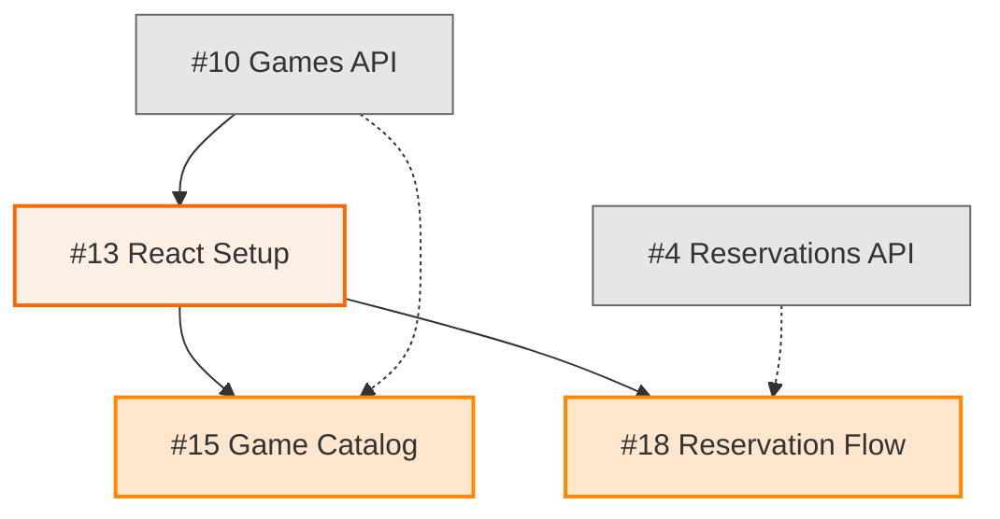
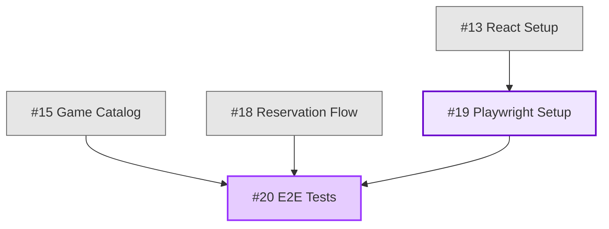
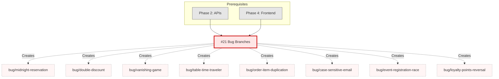
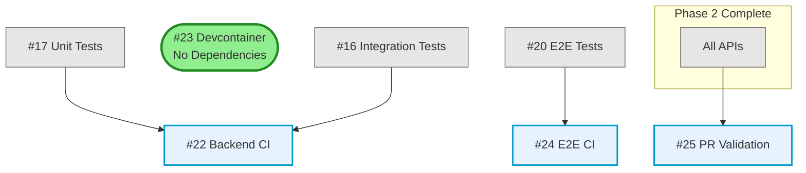
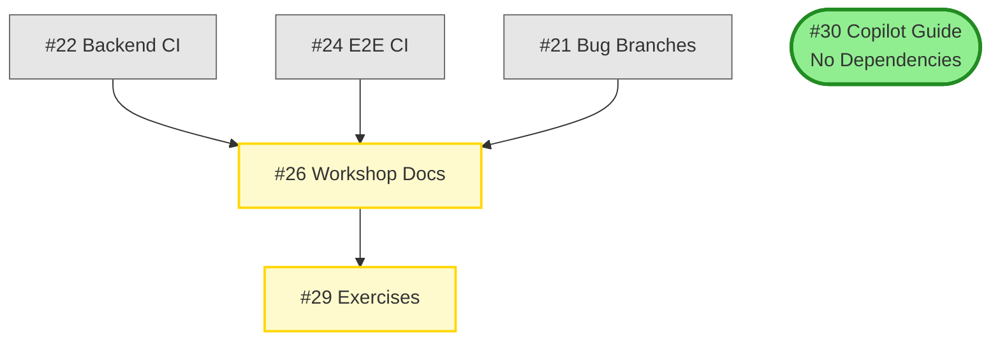
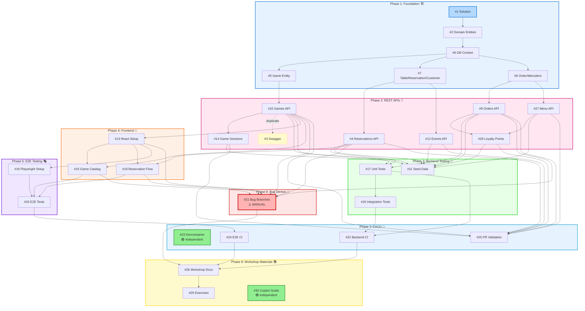

# Board Game Café Management System

> Demo environment for Testing Automation engineers showcasing GitHub Copilot's testing capabilities

[](https://dotnet.microsoft.com/)
[](https://reactjs.org/)
[](https://www.typescriptlang.org/)
[](https://opensource.org/licenses/MIT)
[](https://github.com/equalizer999/board-game-jam/actions/workflows/ci.yml)
[](https://codecov.io/gh/equalizer999/board-game-jam)


> 📖 **Documentation:** For detailed information about issue dependencies and assignment order, see [docs/DEPENDENCY_SETUP.md](docs/DEPENDENCY_SETUP.md)

## 🎯 Purpose

This repository provides a **fork-friendly demo environment** for Test Engineers to explore GitHub Copilot's capabilities across:

- ✅ **Unit Test Generation** - C# backend business logic testing
- 🌐 **Web API Testing** - REST endpoint contract testing with Swagger/OpenAPI
- 🎭 **Visual/UI Testing** - Playwright cross-browser automation (Chrome, Safari, Firefox)
- 🐛 **Bug Hunting & Regression Tests** - Intentional bugs to find and fix
- 🎲 **Test Data Generation** - Realistic mocks and seed data
- 🚀 **CI/CD Integration** - GitHub Actions automation

## 🎮 What You'll Build

A **Board Game Café Management System** featuring:

### Customer Features
- 🎲 Browse game catalog with filters (player count, complexity, category)
- 📅 Reserve tables with visual availability calendar
- 🍕 Order food & beverages from themed menu
- 🎟️ Register for events (tournaments, game nights)
- ⭐ Loyalty points & membership tiers (Bronze/Silver/Gold)

### Staff Features
- ✅ Check-in reservations
- 📦 Game inventory checkout/return tracking
- 🍔 Order fulfillment queue
- 🎉 Event management

### Admin Features
- 📚 Game catalog management
- 🍽️ Menu item configuration
- 📊 Analytics & reporting

## 🏗️ Architecture

### Backend
- **.NET 9.0** Minimal APIs (Vertical Slice Architecture)
- **Entity Framework Core** with SQLite (default) / PostgreSQL (optional)
- **Swashbuckle** for auto-generated OpenAPI/Swagger documentation
- **FluentValidation** for request validation
- **xUnit** + **FluentAssertions** for testing

### Frontend
- **React 18+** with TypeScript
- **Vite** for blazing-fast development
- **TanStack Query** for server state management
- **Playwright** for E2E testing

### DevOps
- **VS Code DevContainer** (zero-config setup)
- **GitHub Actions** CI/CD workflows
- **Docker Compose** for optional PostgreSQL

## 🚀 Quick Start

### Option 1: GitHub Codespaces (Recommended)

1. Click **Code** → **Create codespace on main**
2. Wait for automatic setup (dependencies, migrations, seed data)
3. Open Swagger UI: `http://localhost:5000/swagger`
4. Start frontend: Terminal → Run Task → `watch:client`

### Option 2: Local Development

**Prerequisites:**
- [.NET 9 SDK](https://dotnet.microsoft.com/download)
- [Node.js 20+ LTS](https://nodejs.org/)
- [VS Code](https://code.visualstudio.com/)

```bash
# Clone repository
git clone https://github.com/equalizer999/board-game-jam.git
cd board-game-jam

# Restore backend
cd src/BoardGameCafe.Api
dotnet restore
dotnet ef database update
dotnet run

# In new terminal: Start frontend
cd client
npm install
npm run dev
```

**Access:**
- Frontend: http://localhost:5173
- API: http://localhost:5000
- Swagger: http://localhost:5000/swagger

## 📚 Workshop Structure

This demo maps to a **60-minute workshop agenda**:

| Time | Topic | Demo Focus |
|------|-------|------------|
| 0-15min | Welcome & Context | Copilot capabilities overview |
| 15-25min | Unit Test Generation | `OrderCalculationService`, `ReservationValidator` |
| 25-33min | Web API Testing | REST endpoints, Swagger contract testing |
| 33-40min | UI Testing (Playwright) | Cross-browser reservation workflow |
| 40-50min | Bug Hunting & Regression | Intentional bugs in separate branches |
| 50-55min | CI/CD Integration | GitHub Actions test automation |
| 55-60min | Q&A | Live test generation |

### 📖 Reference Materials

**GitHub Copilot Resources:**
- **[Copilot Quick Prompts](docs/copilot-quick-prompts.md)** - Copy-paste ready prompts for common tasks
- **[Copilot Prompts Guide](docs/copilot-prompts-guide.md)** - Effective prompts for test generation
- **[Testing Engineer's Copilot Guide](docs/testing-engineer-copilot-guide.md)** - QA-focused workflows and prompts
- **[Copilot Agent Assignment Guide](docs/copilot-agent-assignment-guide.md)** - How to assign issues to Copilot

**Testing & Development:**
- **[Bug Hunting Guide](docs/bug-hunting-guide.md)** - Intentional bugs with hints
- **[API Testing Guide](docs/api-testing-guide.md)** - Using Swagger for exploration
- **[Implementation Roadmap](docs/ROADMAP.md)** - Phased development plan with issue dependencies

**Prompt Templates:**
- **[Unit Test Templates](.github/copilot/unit-test-templates.md)** - xUnit test generation prompts
- **[Integration Test Templates](.github/copilot/integration-test-templates.md)** - API endpoint test prompts
- **[E2E Test Templates](.github/copilot/e2e-test-templates.md)** - Playwright test prompts

### 🎯 Exercise Folders

The `/exercises` folder contains workshop prompts with TODO markers for live demonstrations:

- `01-unit-testing.md` - Service layer testing exercises
- `02-api-testing.md` - Integration test scenarios
- `03-ui-testing.md` - Playwright workflow examples
- `04-bug-hunting.md` - Regression test challenges

## 🐛 Intentional Bugs

Separate branches contain curated bugs for regression testing practice:

- `bug/midnight-reservation` - Timezone conversion issue
- `bug/double-discount` - Negative totals from discount stacking
- `bug/vanishing-game` - Cache invalidation on checkout
- `bug/table-time-traveler` - Past date validation bypass
- `bug/order-item-duplication` - Race condition on rapid clicks
- `bug/case-sensitive-email` - Duplicate accounts with email casing
- `bug/event-registration-race` - Concurrency on last event spot
- `bug/loyalty-points-reversal` - Cancelled orders don't deduct points

Each bug has a linked GitHub Issue with reproduction steps.

## 🗄️ Database Management

The project uses **Entity Framework Core 9** with **SQLite** for data persistence.

### Migration Commands

```bash
# Navigate to API project
cd src/BoardGameCafe.Api

# List all migrations
dotnet ef migrations list

# Add a new migration
dotnet ef migrations add <MigrationName>

# Apply migrations to database
dotnet ef database update

# Revert to a specific migration
dotnet ef database update <MigrationName>

# Remove last migration (if not applied)
dotnet ef migrations remove

# Generate SQL script for migrations
dotnet ef migrations script
```

### Database Configuration

- **Provider:** SQLite (Microsoft.EntityFrameworkCore.Sqlite v9.0.10)
- **Connection String:** `Data Source=data/dev.db;Cache=Shared`
- **Database File:** `src/BoardGameCafe.Api/data/dev.db`
- **Auto-Migration:** Database is automatically created and migrations applied on startup in development mode

### Existing Migrations

1. **20251031150245_InitialCreate** - Initial database schema with Game, Table, Customer, and Reservation entities
2. **20251031161248_AddOrdersMenuEventsGameSessions** - Added Order, MenuItem, Event, EventRegistration, and GameSession entities
3. **20251031165824_UpdateTableCustomerReservationEntities** - Updated Table, Customer, and Reservation entities with additional properties

**Note:** The database file (`*.db`, `*.db-shm`, `*.db-wal`) is excluded from version control via `.gitignore`.

## 🧪 Testing

```bash
# Backend unit tests
dotnet test src/BoardGameCafe.Tests.Unit

# Backend integration tests
dotnet test src/BoardGameCafe.Tests.Integration

# Frontend unit tests
cd client && npm test

# E2E tests (Playwright)
cd client && npx playwright test

# E2E with UI
cd client && npx playwright test --ui

# Specific browser
cd client && npx playwright test --project=chromium
```

## 🏷️ Labels

Issues are tagged with:

- `backend` - .NET API work
- `frontend` - React UI work
- `testing` - Test infrastructure
- `devcontainer` - Development environment
- `bug-demo` - Intentional bugs for workshops
- `documentation` - Guides and READMEs
- `ci-cd` - GitHub Actions workflows
- `seed-data` - Database seeding
- `api` - REST endpoint development
- `swagger` - OpenAPI documentation
- `exercise` - Workshop exercises
- `performance` - Optimization tasks

## 🤖 Assigning Issues to GitHub Copilot

This repository is designed for **GitHub Copilot Coding Agent** to autonomously implement issues. Copilot analyzes problem statements, generates code, runs tests, and creates pull requests.

### Quick Start Example

**Step 1:** Navigate to an issue (e.g., [Issue #5 - Create Game Domain Entity](https://github.com/equalizer999/board-game-jam/issues/5))

**Step 2:** Assign to Copilot using one of these methods:

**Method 1 - Comment Assignment:**
```bash
# In the issue comment:
@copilot please implement this issue following the acceptance criteria
```

**Method 2 - Direct Assignment:**
- Click "Assignees" → Search for "copilot" → Assign

**Step 3:** Monitor Progress
- Copilot creates a PR within 5-15 minutes
- Review the implementation
- Approve & merge, or request changes

### 📖 Detailed Guide

For best practices on writing Copilot-friendly issues, troubleshooting, and maximizing effectiveness, see:

**[Complete Copilot Agent Assignment Guide](docs/copilot-agent-assignment-guide.md)**

Topics covered:
- ✅ How to structure problem statements and acceptance criteria
- ✅ Examples of good vs bad issue descriptions
- ✅ Providing context and technical constraints
- ✅ Monitoring Copilot's progress and reviewing PRs
- ✅ Troubleshooting common issues
- ✅ Copilot capabilities and limitations
- ✅ Tips for maximum effectiveness
## 🔗 Issue Dependencies & Assignment Order

To maximize GitHub Copilot effectiveness, follow this dependency-based assignment order:

### Quick Start Path

**Recommended first assignments to Copilot:**
1. Issue #1 → #2 → #6 → Then choose parallel tracks below

### Phase 1: Foundation (Sequential) 🏗️



**Legend:** 🔵 Sequential | 🔴 Can parallelize after #6

### Phase 2: REST APIs (Parallelize after Phase 1) 🚀



**Legend:** ⚪ Prerequisites | 🟣 Core APIs (can parallelize) | 🔵 Dependent APIs | ⚠️ #3 is duplicate of #10

### Phase 3: Backend Testing (After Phase 2) 🧪



**Note:** All three can be assigned in parallel

### Phase 4: Frontend (Can start after APIs exist) 🎨



**Legend:** ⚪ Prerequisites | 🟠 Foundation | 🟡 Features (can parallelize)

### Phase 5: E2E Testing (After Phase 4) 🎭



### Phase 6: Bug Demonstrations (Manual) 🐛



**⚠️ WARNING:** This is a MANUAL task - do NOT assign to Copilot initially!

### Phase 7: CI/CD (Can parallelize) 🔄



**Note:** #23 can start anytime, others can parallelize with their dependencies met

### Phase 8: Workshop Materials (Final Phase) 📚




### Optimal Assignment Strategy

#### For Maximum Parallelization:
1. **Week 1:** #1 → #2 → #6 → [#5, #7, #8 in parallel] → [#10, #4, #9, #27, #12 in parallel]
2. **Week 2:** #14 → #28 → [#17, #16, #11 in parallel] → #13 → [#15, #18 in parallel]
3. **Week 3:** #19 → #20 → #21 (manual) → [#22, #23, #24, #25 in parallel]
4. **Week 4:** [#26, #29, #30 in parallel]

#### For Linear/Learning Path:
Follow the phase order strictly: Phase 1 → Phase 2 → Phase 3 → Phase 4 → Phase 5 → Phase 6 → Phase 7 → Phase 8

### Complete Dependency Overview

Below is the complete dependency graph showing all 30 issues and their relationships across 8 phases:



**Color Legend:**
- 🔵 **Phase 1**: Foundation - Project structure and database
- 🟣 **Phase 2**: REST APIs - Backend endpoints
- 🟢 **Phase 3**: Backend Testing - Unit & integration tests
- 🟠 **Phase 4**: Frontend - React components
- 🟣 **Phase 5**: E2E Testing - Playwright automation
- 🔴 **Phase 6**: Bug Demos - Workshop practice scenarios
- 🔵 **Phase 7**: CI/CD - Automated workflows
- 🟡 **Phase 8**: Workshop Materials - Documentation

**Special Markers:**
- 🟢 **Green nodes**: Independent (no dependencies)
- 🔴 **Red highlight**: Manual task (#21)
- ⚠️ **Dashed**: Duplicate issue (#3)


### Issue Chaining with GitHub

When viewing any issue, check the "Depends on" and "Blocks" sections in the issue description (updated for all 30 issues) to see:
- **Depends on:** Issues that must be completed first
- **Blocks:** Issues that are waiting for this one to complete

This information helps you:
- Prioritize work correctly
- Avoid merge conflicts
- Understand the full context of each task
- See the bigger picture of how features connect

---


**See [docs/ROADMAP.md](docs/ROADMAP.md) for detailed issue assignment strategy and phase dependencies.**

## 📈 Checkpoint Branches

Progressive implementation stages:

- `01-basic-crud` - Initial domain models + CRUD APIs
- `02-add-validation` - FluentValidation + error handling
- `03-business-logic` - Reservation conflicts, late fees, discounts
- `04-add-tests` - Full test coverage
- `05-complete` - Production-ready with CI/CD

## 🎨 Fun Elements

### Game-Themed Menu Items
- "Meeple Mocha" ☕
- "Catan Cappuccino" ☕
- "Ticket to Chai" 🍵
- "Pandemic Pizza" 🍕
- "Wingspan Wings" 🍗

### Loyalty Tiers
- 🥉 Bronze Explorer (0-499 points) - 5% discount
- 🥈 Silver Strategist (500-1999 points) - 10% discount + early event access
- 🥇 Gold Grandmaster (2000+ points) - 15% discount + free monthly rental

## 📊 Implementation Status

### Completed Issues
- ✅ **Issue #6**: Implement SQLite Database Context with EF Core 9
  - Added Microsoft.EntityFrameworkCore.Sqlite 9.0.10 and Microsoft.EntityFrameworkCore.Design 9.0.10 packages
  - Created BoardGameCafeDbContext in src/BoardGameCafe.Api/Data/ with DbSet properties for all core entities (Games, Tables, Customers, Reservations, MenuItems, Orders, OrderItems, Events, EventRegistrations, GameSessions)
  - Configured connection string in appsettings.json: `Data Source=data/dev.db;Cache=Shared`
  - Added DbContext registration in Program.cs with SQLite provider
  - Created three migrations: InitialCreate, AddOrdersMenuEventsGameSessions, UpdateTableCustomerReservationEntities
  - Configured data/ directory with .db files properly gitignored
  - Added database initialization/migration logic to run on startup (context.Database.MigrateAsync())
  - Configured cascade delete behaviors and default values in OnModelCreating
  - Documented migration commands in README
  - Verified: migrations list shows all three migrations, API starts successfully, data/dev.db file is created, Swagger UI loads at /swagger
- ✅ **Issue #5**: Create Game Domain Entity and Repository Pattern
  - Created Game entity with all required properties (Id, Title, Publisher, MinPlayers, MaxPlayers, PlayTimeMinutes, AgeRating, Complexity, Category, CopiesOwned, CopiesInUse, DailyRentalFee, Description, ImageUrl)
  - Added data annotations for validation (Required, MaxLength, Range constraints)
  - Configured entity in DbContext with fluent API
  - Added indexes on Title and Category for performance
  - Added check constraint: CopiesInUse <= CopiesOwned
  - Implemented IsAvailable computed property (CopiesOwned > CopiesInUse)
  - Created and applied EF migration for Game table
  - Seeded database with 5 sample games (Catan, Ticket to Ride, Pandemic, Codenames, Azul)
- ✅ **Issue #7**: Create Table, Reservation, and Customer Domain Entities
  - Updated Table entity with SeatingCapacity (2-8), IsWindowSeat, IsAccessible, HourlyRate, and Status enum
  - Updated Customer entity with Email (unique, case-insensitive), Phone, MembershipTier (None/Bronze/Silver/Gold), LoyaltyPoints, JoinedDate, and TotalVisits
  - Updated Reservation entity with proper relationships and indexes
  - Configured cascade delete: Customer cascade, Table restrict
  - Created and applied EF migration
  - Seeded database with 5 tables, 3 customers, 2 reservations

- ✅ **Issue #4**: Build Reservations REST API with Availability Checking
  - Created Features/Reservations folder with vertical slice architecture
  - Implemented DTOs: ReservationDto, CreateReservationRequest, UpdateReservationRequest, AvailabilityQuery, AvailableTableDto
  - Implemented all 7 Minimal API endpoints with XML documentation and Swagger support:
    - GET /api/v1/reservations - List customer's reservations
    - GET /api/v1/reservations/{id} - Get single reservation
    - POST /api/v1/reservations - Create reservation with validation
    - PUT /api/v1/reservations/{id} - Update reservation
    - DELETE /api/v1/reservations/{id} - Cancel reservation
    - POST /api/v1/reservations/{id}/check-in - Mark as checked in
    - GET /api/v1/reservations/availability - Query available tables
  - Implemented reservation conflict detection with 15-minute buffer between reservations
  - Added business validation: party size ≤ table capacity, future dates only, valid time ranges
  - Proper error handling: 400 Bad Request, 404 Not Found, 409 Conflict for double-booking
  - Created 18 comprehensive integration tests (all passing)
  - Total test coverage: 27 tests (7 unit + 20 integration)
- ✅ **Issue #8**: Implement Order and MenuItem Entities with Pricing Logic
  - Created MenuItem entity with all required properties (Id, Name, Description, Category, Price, IsAvailable, PreparationTimeMinutes, AllergenInfo, IsVegetarian, IsVegan, IsGlutenFree)
  - Created Order entity with properties (Id, CustomerId, ReservationId, OrderDate, Status, Subtotal, DiscountAmount, TaxAmount, TotalAmount, PaymentMethod)
  - Created OrderItem entity (Id, OrderId, MenuItemId, Quantity, UnitPrice, SpecialInstructions)
  - Configured relationships: Order 1-to-many OrderItems, Customer 1-to-many Orders
  - Added computed properties and pricing logic methods:
    - Tax calculation: 8% on food, 10% on alcohol
    - Member discounts: Bronze 5%, Silver 10%, Gold 15%
    - UnitPrice snapshot in OrderItem for price history
  - Seeded 22 themed menu items across all categories (Coffee, Tea, Snacks, Meals, Desserts, Alcohol)
  - Created 10 comprehensive unit tests for order pricing calculations
  - All tests passing (17 unit + 2 integration)

- ✅ **Issue #19**: Set up Playwright for E2E Testing
  - Installed Playwright test library (@playwright/test)
  - Configured `playwright.config.ts` with:
    - Projects for chromium, firefox, webkit browsers
    - Base URL: http://localhost:5173
    - Headless mode in CI, headed for local development
    - Screenshot on test failure
    - Video recording on retry
    - Parallel execution: 1 worker in CI, 4 workers locally
    - 2 retries for failed tests in CI
    - Auto-start dev server before tests
  - Created E2E test folder structure:
    - `tests/e2e/fixtures/` - Test data and API seeding helpers
    - `tests/e2e/pages/` - Page Object Models
    - `tests/e2e/specs/` - Test specifications
  - Implemented Page Object Models:
    - `GameCatalogPage.ts` - Game browsing, filtering, and detail viewing
    - `ReservationPage.ts` - Table booking workflow and availability
    - `OrderPage.ts` - Menu ordering and cart management
  - Created comprehensive test fixtures:
    - Sample games, tables, menu items, and customers
    - Helper functions for API seeding via backend endpoints
    - Date/time utilities for reservation testing
  - Implemented first E2E test suite (`game-browsing.spec.ts`):
    - Navigate to game catalog and verify games load
    - Apply category filter (Strategy) and verify filtered results
    - Click game card and verify detail modal opens
    - Multiple filter criteria testing
    - Search functionality
    - No results handling
    - Modal open/close functionality
  - Added npm scripts:
    - `test:e2e` - Run all E2E tests
    - `test:e2e:ui` - Open Playwright UI mode
    - `test:e2e:headed` - Run tests in headed mode
    - `test:e2e:debug` - Run tests in debug mode
    - `test:e2e:chromium/firefox/webkit` - Run tests on specific browser
  - Uses data-testid attributes for stable, maintainable selectors
  - Follows Page Object pattern for reusability and maintainability
  - Leverages Playwright's auto-waiting features for reliability

- ✅ **Issue #9**: Build Event Management and Registration System with Capacity Control
  - Updated Event entity with ImageUrl property and CurrentParticipants computed property
  - Created EventRegistration entity with proper enums (RegistrationStatus, PaymentStatus)
  - Configured relationships: Event 1-to-many EventRegistrations with cascade delete
  - Added unique constraint on EventId + CustomerId to prevent duplicate registrations
  - Created Features/Events folder with vertical slice architecture
  - Implemented DTOs: EventDto, CreateEventRequest, RegisterForEventRequest, EventRegistrationDto
  - Implemented all 6 Minimal API endpoints with Swagger documentation:
    - GET /api/v1/events - List upcoming events
    - GET /api/v1/events/{id} - Get event details with participant count
    - POST /api/v1/events - Create event (admin)
    - POST /api/v1/events/{id}/register - Register customer with capacity validation
    - DELETE /api/v1/events/{id}/register - Cancel registration
    - GET /api/v1/events/{id}/participants - List registrations (staff/admin)
  - Implemented capacity validation: prevent registration when CurrentParticipants >= MaxParticipants
  - Handled concurrency for last spot registration using Serializable transaction isolation
  - Returns 409 Conflict when event is full or customer already registered
  - CurrentParticipants computed from non-cancelled registrations only
  - Created and applied EF Core migration (UpdateEventManagement)
  - Created 13 comprehensive integration tests covering all scenarios
  - All tests passing (17 unit + 33 integration)
- ✅ **Issue #10 / #3**: Build Games CRUD REST API Endpoints with Swagger Documentation
  - Created Features/Games folder with vertical slice architecture
  - Implemented DTOs: GameDto, CreateGameRequest, UpdateGameRequest, GameFilterRequest
  - Implemented all 5 Minimal API endpoints with XML documentation and Swagger support:
    - GET /api/v1/games - List/filter games with pagination (category, player count, availability filters)
    - GET /api/v1/games/{id} - Get single game by ID
    - POST /api/v1/games - Create new game (admin placeholder)
    - PUT /api/v1/games/{id} - Update existing game (admin placeholder)
    - DELETE /api/v1/games/{id} - Soft delete game (admin placeholder)
  - Added proper response types: 200 OK, 201 Created, 400 Bad Request, 404 Not Found, 409 Conflict
  - Implemented request validation using Data Annotations
  - Manual entity-to-DTO mapping for optimal performance
  - Business rules: MinPlayers ≤ MaxPlayers, CopiesInUse ≤ CopiesOwned, no deletion if copies in use
  - Created 17 comprehensive integration tests (all passing)
  - Total test coverage: 37 tests (20 reservation + 17 games integration)
  - Verified all endpoints appear in Swagger UI with proper documentation

- ✅ **Issue #28**: Build Customer Loyalty Program REST API with Points Tracking and Tier Management
  - Created `LoyaltyPointsHistory` domain entity to track all point transactions
  - Updated DbContext with LoyaltyPointsHistory table configuration and indexes
  - Created and applied EF Core migration (AddLoyaltyPointsHistory)
  - Created `Features/Customers/` folder with vertical slice architecture
  - Implemented DTOs: CustomerDto, UpdateCustomerRequest, LoyaltyPointsDto, LoyaltyTransactionDto, VisitStatsDto
  - Implemented all 7 Minimal API endpoints with XML documentation and Swagger support:
    - GET /api/v1/customers/me - get current customer profile
    - PUT /api/v1/customers/me - update profile (first name, last name, phone)
    - GET /api/v1/customers/me/loyalty-points - get points balance, tier, discount %, and progress to next tier
    - GET /api/v1/customers/me/loyalty-history - list point transactions (earned, redeemed, sorted by date)
    - POST /api/v1/customers/me/favorites - add game to favorites (placeholder)
    - DELETE /api/v1/customers/me/favorites/{gameId} - remove from favorites (placeholder)
    - GET /api/v1/customers/me/visit-stats - total visits, games played, spending, avg order value
  - Implemented tier upgrade logic with automatic tier updates:
    - Bronze: 0-499 points (5% discount)
    - Silver: 500-1999 points (10% discount)
    - Gold: 2000+ points (15% discount)
  - Added loyalty points tracking in Orders API:
    - Points earned tracked when order is paid (1 point per $1 spent)
    - Points redeemed tracked when order is submitted (100 points = $1 discount)
  - Implemented validation: can't redeem more points than balance
  - Created 15 comprehensive integration tests covering all scenarios:
    - Profile management (get, update)
    - Loyalty points tiers (None, Bronze, Silver, Gold with correct discounts)
    - Points history tracking (earned and redeemed transactions)
    - Visit statistics
    - Favorites management
    - Integration with Orders API for points earning and redemption
  - All tests passing (38 unit + 81 integration = 119 total)
  - Verified all endpoints appear in Swagger UI with proper documentation

- ✅ **Issue #28**: Build Customer Loyalty Program REST API
  - Created `LoyaltyPointsHistory` domain entity for tracking point transactions (earned, redeemed, adjustments)
  - Updated `Customer` entity with `FavoriteGames` collection (many-to-many relationship)
  - Updated `AppDbContext` with `LoyaltyPointsHistory` DbSet and configuration
  - Created EF migration `AddLoyaltyPointsHistory` for new table and customer favorites join table
  - Created `Features/Customers/` folder with vertical slice architecture
  - Implemented DTOs: `CustomerDto`, `LoyaltyPointsDto`, `LoyaltyTransactionDto`, `UpdateCustomerRequest`, `VisitStatsDto`
  - Implemented all 7 Minimal API endpoints with Swagger documentation:
    - GET /api/v1/customers/me - Get current customer profile
    - PUT /api/v1/customers/me - Update profile (name, phone)
    - GET /api/v1/customers/me/loyalty-points - Get points balance and tier with progress
    - GET /api/v1/customers/me/loyalty-history - List point transactions (ordered by date)
    - POST /api/v1/customers/me/favorites - Add game to favorites
    - DELETE /api/v1/customers/me/favorites/{gameId} - Remove game from favorites
    - GET /api/v1/customers/me/visit-stats - Total visits, games played, spending
  - Implemented tier upgrade logic with helper methods:
    - None: 0 points (0% discount)
    - Bronze: 1-499 points (5% discount)
    - Silver: 500-1999 points (10% discount)
    - Gold: 2000+ points (15% discount)
  - Shows tier progress: points to next tier (e.g., "250 points to Silver")
  - Gold tier shows no next tier (top tier achieved)
  - Configured cascade delete for LoyaltyPointsHistory when customer deleted
  - Configured many-to-many relationship for favorite games with join table
  - Created 14 comprehensive integration tests covering all scenarios (all passing)
  - Total test coverage: 118 tests (38 unit + 80 integration)

- ✅ **Issue #27**: Build Menu Catalog Management REST API with Filtering
  - Created Features/Menu folder with vertical slice architecture
  - Implemented DTOs: MenuItemDto, CreateMenuItemRequest, UpdateMenuItemRequest, MenuFilterRequest
  - Implemented all 6 Minimal API endpoints with XML documentation and Swagger support:
    - GET /api/v1/menu - List/filter menu items (category, dietary, availability, price filters)
    - GET /api/v1/menu/{id} - Get single menu item by ID
    - POST /api/v1/menu - Create menu item (admin placeholder)
    - PUT /api/v1/menu/{id} - Update menu item (admin placeholder)
    - DELETE /api/v1/menu/{id} - Soft delete (set IsAvailable = false)
    - GET /api/v1/menu/categories - List all available categories
  - Added comprehensive filtering support:
    - By category (Coffee, Tea, Snacks, Meals, Desserts, Alcohol)
    - By dietary flags (isVegetarian, isVegan, isGlutenFree)
    - By availability (IsAvailable)
    - By price range (minPrice, maxPrice)
  - Added proper response types: 200 OK, 201 Created, 400 Bad Request, 404 Not Found, 409 Conflict
  - Implemented soft delete pattern using IsAvailable flag
  - Includes preparation time and allergen information in responses
  - Created 15 comprehensive integration tests (all passing)
  - Total test coverage: 119 tests (38 unit + 81 integration)
  - Verified all endpoints appear in Swagger UI with proper documentation

## 🤝 Contributing

This is a **demo repository** designed for workshops. For local customization:

1. Fork the repository
2. Create feature branch (`git checkout -b feature/your-idea`)
3. Run tests (`dotnet test && npm test`)
4. Commit with conventional commits
5. Open a Pull Request

## 📄 License

MIT License - see [LICENSE](LICENSE) file for details.

## 🙏 Acknowledgments

Built to showcase GitHub Copilot's testing capabilities for Test Automation engineers.

---

**Ready to explore?** Open the first issue and assign it to Copilot! 🚀