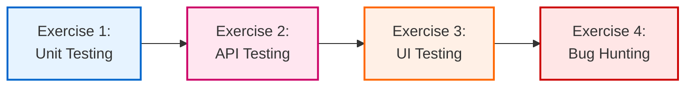

# Workshop Exercises: Testing with GitHub Copilot

Welcome to the Board Game Café workshop exercises! These hands-on exercises guide you through using GitHub Copilot to generate comprehensive tests across the testing pyramid.

---

## 📋 Overview

These exercises are designed for a **60-minute workshop** focused on GitHub Copilot's testing capabilities. Each exercise builds on the previous one and aligns with the workshop agenda.

**Total Duration**: 45-65 minutes  
**Difficulty Progression**: Beginner → Intermediate → Advanced

---

## 🎯 Learning Path



---

## 📚 Exercise List

### [Exercise 1: Unit Testing with GitHub Copilot](./01-unit-testing.md)
**Duration**: 10-15 minutes | **Difficulty**: ⭐ Beginner

**Focus**: Generate unit tests for service layer business logic

**You Will Learn**:
- Generate unit tests using Copilot prompts
- Structure tests with Arrange-Act-Assert pattern
- Use FluentAssertions for readable assertions
- Create parameterized tests with `[Theory]`

**Prerequisites**:
- ✅ Backend API running
- ✅ xUnit and FluentAssertions installed

**Key Topics**:
- Order calculation service testing
- Tax calculation (8% food, 10% alcohol)
- Member discounts (Bronze/Silver/Gold tiers)
- Edge case handling

**Success Criteria**:
- [ ] 10+ unit tests created
- [ ] Code coverage >80%
- [ ] All edge cases tested
- [ ] Tests use FluentAssertions

---

### [Exercise 2: Web API Testing with Swagger](./02-api-testing.md)
**Duration**: 8-12 minutes | **Difficulty**: ⭐⭐ Beginner-Intermediate

**Focus**: Explore and test REST APIs using Swagger and integration tests

**You Will Learn**:
- Navigate Swagger UI for API exploration
- Write integration tests for HTTP endpoints
- Validate API contracts and schemas
- Test error scenarios (400, 404, 409)

**Prerequisites**:
- ✅ Swagger UI at `https://localhost:5001/swagger`
- ✅ Games and Reservations APIs implemented

**Key Topics**:
- GET/POST/PUT/DELETE endpoint testing
- Query parameter filtering
- Request/response validation
- Status code verification

**Success Criteria**:
- [ ] All integration tests pass
- [ ] Success and error scenarios covered
- [ ] Response schemas validated
- [ ] Tests isolated and repeatable

---

### [Exercise 3: UI Testing with Playwright](./03-ui-testing.md)
**Duration**: 15-20 minutes | **Difficulty**: ⭐⭐⭐ Intermediate

**Focus**: End-to-end UI testing across browsers using Playwright

**You Will Learn**:
- Create Page Object Models
- Write cross-browser E2E tests
- Handle async UI interactions
- Capture screenshots on failure

**Prerequisites**:
- ✅ Frontend running at `http://localhost:5173`
- ✅ Playwright installed (`npx playwright install`)

**Key Topics**:
- Game catalog browsing and filtering
- Reservation workflow testing
- Modal interactions
- Cross-browser testing (Chrome, Firefox, Safari)

**Success Criteria**:
- [ ] Page Object Models for all pages
- [ ] Complete reservation flow test passes
- [ ] Tests pass on 3 browsers
- [ ] Screenshots on failure configured

---

### [Exercise 4: Bug Hunting and Regression Testing](./04-bug-hunting.md)
**Duration**: 12-18 minutes | **Difficulty**: ⭐⭐⭐⭐ Intermediate-Advanced

**Focus**: Find bugs, write regression tests, debug with Copilot

**You Will Learn**:
- Reproduce and isolate bugs
- Write failing tests first
- Debug async and race conditions
- Use Copilot for debugging assistance

**Prerequisites**:
- ✅ Exercises 1-3 completed
- ✅ Familiarity with codebase

**Key Topics**:
- **Bug #1**: Midnight reservation timezone issue
- **Bug #2**: Double discount race condition
- **Bug #3**: Game availability logic error
- **Bug #4**: Past date validation missing
- **Bug #5**: Order item duplication

**Success Criteria**:
- [ ] All 5 bugs identified
- [ ] Failing test for each bug
- [ ] All bugs fixed
- [ ] 2+ regression tests per bug

---

## 🚀 Getting Started

### Quick Setup

```bash
# 1. Start backend API
cd src/BoardGameCafe.Api
dotnet run

# 2. Start frontend (new terminal)
cd client
npm run dev

# 3. Verify Swagger
# Open: https://localhost:5001/swagger

# 4. Run existing tests
dotnet test
cd client && npm test
```

### Workshop Flow

**Recommended approach for 60-minute workshop**:

| Time | Activity | Exercise |
|------|----------|----------|
| 0-5 min | Intro & Setup | Verify environment |
| 5-20 min | **Unit Testing** | Exercise 1 |
| 20-32 min | **API Testing** | Exercise 2 |
| 32-52 min | **UI Testing** | Exercise 3 |
| 52-65 min | **Bug Hunting** | Exercise 4 |

**Self-paced approach**:
- Complete exercises in order at your own speed
- Skip bonus challenges initially
- Return for bonus challenges after completing all 4 exercises

---

## 💡 Using GitHub Copilot Effectively

### Best Practices for Exercise Completion

**1. Start with Clear Prompts**
```csharp
// ✅ GOOD: Specific and actionable
// Test: CalculateSubtotal with single item should return quantity * unit price
// Arrange: 1 item, quantity 2, price $10
// Assert using FluentAssertions

// ❌ BAD: Vague
// Write a test for the subtotal thing
```

**2. Iterate on Results**
- Accept Copilot's suggestion
- Review the generated code
- Refine the prompt if needed
- Regenerate or manually adjust

**3. Use Copilot Chat**
```
User: "I'm getting a 409 Conflict error. What does this mean for reservation tests?"
Copilot: "409 indicates the reservation time conflicts with an existing booking..."
```

**4. Ask for Explanations**
```
User: "Explain this test assertion: result.Should().BeGreaterThan(0)"
Copilot: "FluentAssertions provides readable syntax for asserting result is positive..."
```

### Keyboard Shortcuts

- **Accept suggestion**: `Tab`
- **Next suggestion**: `Alt + ]`
- **Previous suggestion**: `Alt + [`
- **Open Copilot Chat**: `Ctrl + I` (Windows/Linux) or `Cmd + I` (Mac)

---

## 📊 Assessment Criteria

### Individual Exercise Success
Each exercise has specific success criteria listed in its file.

### Overall Workshop Success

After completing all exercises, you should have:

- [ ] **20+ unit tests** covering service layer logic
- [ ] **15+ integration tests** for REST APIs
- [ ] **10+ E2E tests** for UI workflows
- [ ] **5+ regression tests** from bug fixes
- [ ] Tests passing on **3 browsers** (Chrome, Firefox, Safari)
- [ ] **>70% code coverage** on tested components

### Copilot Effectiveness Assessment

Track how well Copilot helped you:

| Metric | Target |
|--------|--------|
| First-pass test success | >60% |
| Prompts needing refinement | <40% |
| Time saved vs manual | >50% |
| Tests requiring manual fixes | <30% |

---

## 🎓 Learning Outcomes

By completing these exercises, you will:

✅ **Understand the testing pyramid**
- Unit tests (fast, isolated, many)
- Integration tests (moderate speed, some setup)
- E2E tests (slow, comprehensive, fewer)

✅ **Master Copilot for testing**
- Effective prompt engineering
- Reviewing generated tests
- Iterating on suggestions

✅ **Apply best practices**
- Arrange-Act-Assert pattern
- Meaningful test names
- Edge case coverage
- Regression test importance

✅ **Debug with AI assistance**
- Root cause analysis
- Fix suggestions
- Test generation for bugs

---

## 🔧 Troubleshooting

### Common Issues

**Tests fail due to missing seed data**
```bash
cd src/BoardGameCafe.Api
dotnet ef database update
# Seed data is applied on API startup
```

**Playwright browser not installed**
```bash
cd client
npx playwright install
```

**Copilot not suggesting tests**
- Ensure GitHub Copilot extension is active
- Check your subscription status
- Try more explicit prompts
- Use Copilot Chat for guidance

**API not running**
```bash
# Check port 5001 is not in use
netstat -ano | findstr :5001  # Windows
lsof -i :5001                  # Mac/Linux

# If in use, change port in appsettings.json
```

---

## 📖 Additional Resources

### Documentation
- [Copilot Prompts Guide](../docs/copilot-prompts-guide.md) - Effective prompting techniques
- [Copilot Agent Assignment Guide](../docs/copilot-agent-assignment-guide.md) - Using Copilot for implementation
- [API Testing Guide](../docs/api-testing-guide.md) - Swagger and REST testing
- [Bug Hunting Guide](../docs/bug-hunting-guide.md) - Finding and fixing bugs

### Testing Frameworks
- [xUnit Documentation](https://xunit.net/)
- [FluentAssertions](https://fluentassertions.com/)
- [Playwright for .NET](https://playwright.dev/dotnet/)
- [ASP.NET Core Integration Testing](https://docs.microsoft.com/aspnet/core/test/integration-tests)

### GitHub Copilot
- [GitHub Copilot Documentation](https://docs.github.com/copilot)
- [Copilot Best Practices](https://github.blog/2023-06-20-how-to-write-better-prompts-for-github-copilot/)

---

## 🎉 Bonus Challenges

After completing all 4 exercises, try these advanced challenges:

### Challenge 1: Performance Testing
Add performance benchmarks using BenchmarkDotNet:
```csharp
[Benchmark]
public void OrderCalculation_1000Orders()
{
    // Benchmark order calculation performance
}
```

### Challenge 2: Property-Based Testing
Use FsCheck for property-based testing:
```csharp
[Property]
public Property Subtotal_AlwaysPositive(PositiveInt quantity, PositiveDecimal price)
{
    // Property: subtotal should never be negative
}
```

### Challenge 3: Mutation Testing
Run Stryker.NET to verify test quality:
```bash
dotnet tool install -g dotnet-stryker
dotnet stryker
```

### Challenge 4: Visual Regression Testing
Add Percy or Chromatic for visual regression:
```typescript
await percySnapshot(page, 'Game Catalog - Desktop');
```

---

## 🤝 Contributing

Found an issue or improvement in the exercises?
1. Create an issue describing the problem
2. Submit a PR with the fix
3. Help improve the workshop for others!

---

## 📝 Feedback

After completing the exercises, please provide feedback:
- What worked well?
- What was confusing?
- How could the exercises be improved?
- Rate Copilot's helpfulness (1-5)

---

**Ready to start?** Begin with [Exercise 1: Unit Testing](./01-unit-testing.md) 🚀
